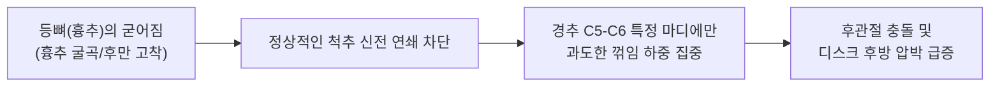

안녕하십니까, 바른관절 헬프센터 센터장 조형준입니다.

![[1] 깍지끼고 경추 신전 및 굴곡 운동 가이드](/images/cervical-extension-flexion-guide.jpg)

진료실에서 목 통증이나 일자목, 거북목으로 고생하시는 환자분들과 상담을 나누다 보면 정말 많은 분들께서 다음과 같은 질문을 하십니다.

> **"원장님, 컴퓨터를 오래 하다가 목이 뻐근할 때 머리 뒤로 깍지를 끼고 목을 뒤로 확 젖히거나 앞으로 꾹 누르면 시원하던데, 이 스트레칭 매일 해도 괜찮은가요?"**

결론부터 명확하게 짚어드리겠습니다.  
이 운동은 **원리를 알고 정확한 궤적으로 수행하면 굳어있는 척추를 깨우는 최고의 명약**이 되지만, **무턱대고 목만 과도하게 꺾어버리면 멀쩡하던 목 디스크(경추 추간판)를 터뜨리는 최악의 독약**이 될 수 있습니다.

오늘은 정형외과 전문의의 시각에서 <mark>경추-흉추 운동 연쇄(Cervicothoracic Kinetic Chain)</mark>에 기반한 깍지 신전·굴곡 운동의 생체역학적 기전과, 목 디스크를 100% 안전하게 보호하면서 관절 가동성을 회복하는 실전 재활 비결을 상세히 브리핑해 드리겠습니다.

---

### 💡 센터장이 이 가이드를 강력 추천하는 3가지 이유

1. <u>단순 목 꺾기가 아닌 '경추-흉추 운동 연쇄' 복원</u>  
   목 통증의 원인은 목 자체보다 굳어버린 '등뼈(흉추)'에 있는 경우가 대부분입니다. 목만 무리하게 꺾는 위험한 방식을 탈피하여, 흉추의 신전을 함께 유도해 <mark>C5-C6 특정 분절에 집중되는 디스크 압박을 70% 이상 분산</mark>시킵니다.

2. <u>머리를 누르는 손이 아닌 '경추 안정화 지레' 역할 재정립</u>  
   많은 분들이 스트레칭을 한답시고 손으로 뒤통수를 강하게 바닥으로 짓누르다 디스크를 악화시킵니다. 깍지 낀 손을 외력으로 누르는 도구가 아니라 머리의 하중을 받쳐주는 '외인성 지지대'로 올바르게 활용하는 정석 테크닉을 알려드립니다.

3. <u>가동성 70%와 안정성 30%의 황금 밸런스 처방</u>  
   목 주변의 겉근육(승모근, 흉쇄유돌근)에 힘이 과하게 들어가는 잘못된 보상작용을 차단하고, 척추 마디마디를 단단히 잡아주는 <mark>심부 굴곡근(경장근·두장근)과 심부 신전근(다열근)</mark>을 부드럽게 깨워 재활 효과를 극대화합니다.

---

### 🔬 생체역학적 분석: 왜 목만 뒤로 젖히면 위험할까요?

우리 목뼈(경추)는 7개의 작은 뼈로 이루어져 있으며, 머리의 회전과 굴곡, 신전을 담당하는 매우 유연한 구조물입니다. 반면 목 아래에 위치한 등뼈(흉추)는 갈비뼈와 연결되어 있어 상대적으로 안정적이지만 현대인의 좌식 생활 속에서 가장 쉽게 굳어버리는(후만 변형) 부위입니다.

#### 1. 흉추가 굳으면 C5-C6 목 디스크가 희생됩니다
정상적인 척추의 움직임에서는 고개를 뒤로 젖힐 때 경추뿐만 아니라 <mark>상부 흉추(T1-T4)가 함께 뒤로 펴져야(Extension)</mark> 합니다. 이를 **경추-흉추 리듬**이라고 부릅니다.  
하지만 흉추가 구부정하게 굳어있는 상태에서 억지로 목을 뒤로 젖히면, 움직임이 분산되지 못하고 가동성이 가장 큰 **경추 5번과 6번(C5-C6) 마디 하나에만 모든 꺾임 하중과 전단력(Shearing Force)이 집중**됩니다. 이로 인해 후관절(Facet Joint)끼리 강하게 부딪치며 염증이 생기거나 신경 구멍이 좁아져 팔 저림이 발생할 수 있습니다.

#### 2. 깍지 낀 손은 '누르는 힘'이 아니라 '버팀목'입니다
머리 뒤에 깍지를 끼는 동작은 목을 억지로 꺾기 위함이 아닙니다.  
성인의 머리 무게는 보통 4-5kg에 달하는데, 목을 젖히거나 숙일 때 깍지 낀 손과 팔은 <mark>경추 후면의 하중을 받쳐주는 외인성 지지대(Exogenous Support)</mark> 역할을 수행해야 합니다. 손으로 머리를 지긋이 받쳐주어 목뼈가 앞뒤로 덜컹거리며 미끄러지는 전단력을 흡수해 주는 것이 핵심입니다.

---

### 📊 올바른 경추 신전·굴곡 운동 단계별 처방표

모바일 환경에서도 한눈에 파악하실 수 있도록 핵심 루틴을 정리해 드립니다.

| 재활 단계 | 운동 동작 | 핵심 타겟 | 세부 실천 요령 (센터장 노하우) | 권장 시간 및 횟수 |
| :--- | :--- | :--- | :--- | :--- |
| **1단계** | **준비 자세 및 그립** | 후두골 하단 안정화 | 뒤통수 튀어나온 뼈 바로 아래 손을 깍지 끼고, 팔꿈치는 180도가 아닌 <mark>60-70도</mark>로 모아 유지 | 호흡 가다듬기 |
| **2단계** | **흉추 주도형 경추 신전** | 상부 흉추 신전 경추 C커브 회복 | 턱을 가볍게 당긴 채 <u>가슴(흉골)을 하늘로 들며</u> 손으로 머리를 위쪽 대각선으로 살짝 뽑아 올리듯 젖힘 | 5-8초 유지 (3-5회 반복) |
| **3단계** | **조절된 경추 굴곡** | 심부 경추 굴곡근 후면 근막 이완 | 절대 손으로 머리를 찍어 누르지 말고, <u>턱을 목젖으로 당기며</u> 자체 무게감으로만 숙임 | 8-10초 유지 (3회 반복) |

---

### 🏋️‍♂️ 센터장이 제안하는 3단계 정석 실천법

#### 1단계: 올바른 깍지 세팅 (후두골 지지)
* 의자에 엉덩이를 깊숙이 넣고 허리를 곧게 폅니다.
* 양손을 깍지 낀 후, 뒤통수 가장 아래쪽 튀어나온 뼈인 **'외후두융기(후두골)' 바로 아래 목덜미 부위**에 손바닥을 부드럽게 밀착시킵니다.
* **중요:** 팔꿈치를 옆으로 너무 과도하게 벌리면 어깨 관절에 충돌이 생기고 등이 꺾입니다. 팔꿈치는 시야에 살짝 들어오는 **약 60-70도 각도**로 자연스럽게 모아주세요.

#### 2단계: 가슴을 열며 뒤로 젖히기 (경추 신전)
* 목만 젖히려고 하지 마세요! **명치와 윗가슴(쇄골)을 천장을 향해 들어 올린다는 느낌**으로 등뼈를 먼저 펴줍니다.
* 턱이 하늘로 치켜들리지 않도록 살짝 당긴 상태를 유지하면서, 깍지 낀 손으로는 머리를 위쪽 대각선(45도) 방향으로 가볍게 견인(Traction)하듯 받쳐 올립니다.
* 숨을 천천히 내쉬면서 기분 좋게 등이 펴지는 느낌으로 5-8초간 유지합니다.

#### 3단계: 누르지 않고 턱 당기며 숙이기 (경추 굴곡)
* 고개를 앞으로 숙일 때 **손에 힘을 주어 머리를 바닥 쪽으로 찍어 누르는 행동은 절대 금물**입니다!
* 손은 그저 머리 뒤에 얹어놓아 '손의 자체 무게'만 전달되게 하세요.
* 턱 끝을 목젖 쪽으로 가볍게 끄덕여 당기면, 뒷목 깊은 곳의 속근육과 후두하근이 시원하게 이완되는 것을 느낄 수 있습니다. 8-10초간 부드럽게 호흡합니다.

---

### ⚠️ 절대 피해야 할 3대 위험 행동

1. <u>손힘으로 머리를 짓누르는 행위</u>  
   목을 앞으로 숙일 때 손으로 머리를 강하게 누르면 경추 디스크 후방에 엄청난 압력이 가해져 **수핵 탈출증(목디스크 파열)**을 유발할 수 있습니다. 손은 누르는 도구가 아니라 '무게추' 역할만 해야 합니다.

2. <u>허리를 뒤로 꺾는 요추 보상작용 (요추 과전만)</u>  
   등(흉추)이 굳어있는 분들은 목을 젖히라고 하면 무의식적으로 배를 내밀며 허리를 꺾어버립니다. 이는 허리 디스크와 척추 관절에 극심한 무리를 줍니다. 복부에 가볍게 힘을 주어 허리가 꺾이지 않도록 단단히 잠가두어야 합니다.

3. <u>어깨가 아픈데 억지로 팔을 올려 깍지 끼는 행위</u>  
   오십견이나 어깨 회전근개 손상이 있는 분들은 팔을 머리 뒤로 넘기는 동작 자체가 어깨 힘줄을 찝히게 만듭니다. 어깨에 통증이 있다면 깍지를 끼지 마시고, <mark>수건을 목 뒤에 둘러 양손으로 수건 끝을 잡고 앞으로 당기며 목을 젖히는 '수건 지지 변형법'</mark>을 적용하세요.

---

### 🩺 센터장의 맺음말

목은 독립된 단일 관절이 아닙니다.  
**머리를 받치는 경추, 갈비뼈를 품고 있는 흉추, 그리고 팔의 움직임을 관장하는 견갑골(날개뼈)**이 하나의 거대한 톱니바퀴처럼 맞물려 돌아갈 때 비로소 목 디스크의 부담이 사라집니다.

오늘 안내해 드린 깍지 신전·굴곡 운동은 단순히 목을 꺾는 스트레칭이 아니라, <mark>굳어있던 척추의 리듬을 정상화하는 정교한 재활 운동</mark>입니다. 하루 세 번, 업무나 학업 틈틈이 실천하셔서 통증 없는 가볍고 상쾌한 목을 되찾으시길 진심으로 응원합니다.

감사합니다.

---

*본 건강 정보는 정형외과 전문의 조형준 센터장의 임상 경험과 의학적 생체역학 지식을 바탕으로 작성되었습니다. 만약 운동 중 팔이나 손가락 끝으로 찌릿한 방사통, 감각 저하, 심한 두통이 느껴진다면 신경 압박의 위험 신호이므로 즉시 동작을 중단하시고 전문의의 정밀 진단을 받으시기 바랍니다.*
